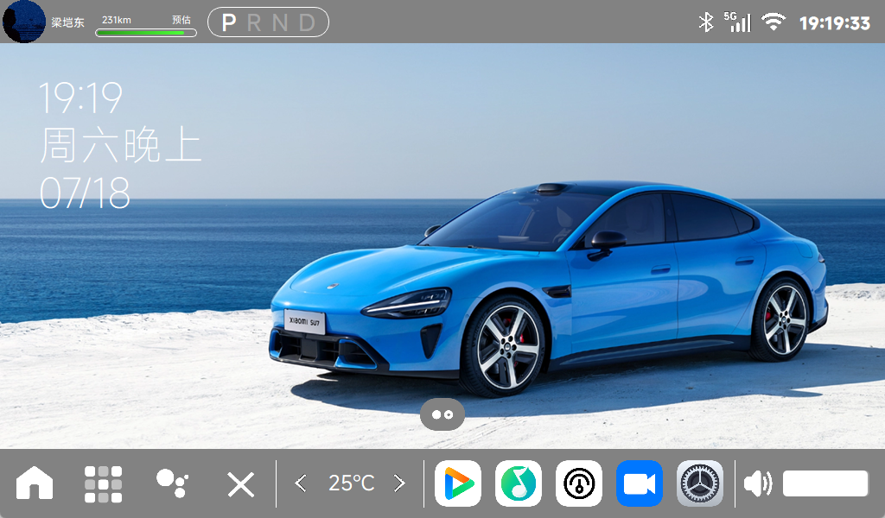

# KaydonOS
基于Qt5.12.9开发的嵌入式车载HMI桌面系统，专属适配**正点原子IMX6ULL-ALPHA**开发板，复刻智能车载终端完整交互逻辑，集成多媒体播放器、硬件传感器、系统工具套件，面向嵌入式Linux学习、毕设实训场景开发。



---

## 📋 项目概述
KaydonOS是一套轻量化嵌入式车载人机交互解决方案，采用C++结合Qt框架开发，针对NXP i.MX6ULL Cortex-A7低性能ARM平台深度优化。系统完整实现车载中控所需的桌面管理、触摸交互、多媒体播放、外设硬件驱动、系统配置持久化等核心功能。

项目采用模块化解耦架构，桌面主程序、独立应用、底层硬件驱动分层隔离，便于新增功能、移植适配；针对512MB内存硬件做资源裁剪，降低CPU与内存占用，保证7寸800×480电容屏流畅运行。

### ✨ 核心亮点
1. **硬件专属适配**：底层驱动、显示参数、触摸逻辑原生适配正点原子IMX6ULL-ALPHA，无需大幅修改即可运行
2. **完整车载桌面交互**：多分页应用桌面、底部常驻导航栏、顶部状态栏、触摸滑动切换页面、模态弹窗提示
3. **一体化多媒体组件**：音乐/视频播放、相机拍照、音频录音、图片相册全套多媒体功能
4. **多传感器底层封装**：DHT11温湿度、ALS距离感应、蜂鸣器、V4L2摄像头驱动统一封装
5. **精准触摸交互**：基于tslib触摸库实现坐标校准、去抖动、多点触摸，适配嵌入式电容屏
6. **持久化配置管理**：MD5校验区分默认配置与用户自定义参数，重启不丢失设置
7. **内置实用工具集**：计算器、日历、倒计时时钟、模拟天气、硬件CPU/内存监控、屏幕亮度音量调节

---

## 📦 完整功能模块介绍
### 一、系统桌面核心模块
| 功能模块 | 详细说明 |
|--------|--------|
| 分页桌面布局 | 应用图标分页存放，支持左右滑动切换页面，图标点击启动对应程序 |
| 全局状态栏 | 实时显示系统时间、音量状态，常驻退出系统快捷按钮 |
| 底部导航栏 | 一键返回桌面、快速进入系统设置，全局常驻不遮挡应用 |
| 弹窗管理系统 | 文件删除、程序退出、操作提示模态弹窗，屏蔽底层触摸误触 |
| 配置持久化引擎 | 首次运行自动生成用户数据目录，区分出厂默认配置与用户修改项 |

### 二、多媒体应用套件
| 应用名称 | 核心功能 |
|--------|--------|
| 音乐播放器 | MP3本地解码、自定义歌单、顺序/单曲循环、独立音量调节 |
| 视频播放器 | AVI视频解码、全屏播放、进度拖拽、暂停/快进控制 |
| 相机应用 | V4L2摄像头采集、实时画面预览、拍照自动保存至相册目录 |
| 录音机 | WAV格式音频录制、录音文件列表管理、录音播放与删除 |
| 图片相册 | 本地图片缩略图加载、全屏浏览、图片删除确认弹窗 |

### 三、车载工具软件
| 应用名称 | 核心功能 |
|--------|--------|
| 计算器 | 基础四则运算、常规小数运算界面 |
| 日历 | 公历日期展示、上下月份切换、日期可视化 |
| 时钟 | 实时数字时钟、简易倒计时功能 |
| 天气面板 | 模拟车载天气界面，展示温度、天气状态图标 |
| 硬件监控 | 实时采集CPU使用率、内存占用并可视化展示 |
| 系统设置 | 屏幕亮度调节、全局系统音量控制 |

### 四、底层硬件驱动模块（适配IMX6ULL硬件引脚）
| 驱动文件 | 硬件功能 |
|--------|--------|
| DHT11温湿度驱动 | 读取环境温度、湿度数据，向上层应用推送数值 |
| ALS距离感应驱动 | 检测前方遮挡距离，可联动屏幕息屏省电逻辑 |
| 蜂鸣器驱动 | IO电平控制，实现闹钟响铃、操作提示音 |
| V4L2摄像头驱动 | Linux标准视频采集接口，图像帧回调Qt界面渲染 |

---

## 🛠️ 开发环境与技术栈
### 环境版本规范
| 分类 | 技术组件 | 指定版本 |
|------|----------|----------|
| 图形开发框架 | Qt | Qt5.12.9（嵌入式稳定版本） |
| 开发语言 | C++ | C++11 标准及以上 |
| 构建工具 | 项目构建 | qmake |
| 触摸支持库 | tslib | tslib 1.21 |
| 交叉编译工具链 | Linaro GCC | gcc-linaro-4.9.4-2017.01 x86_64 arm-linux-gnueabihf |
| 目标内核 | Linux | 4.1.15（IMX6ULL原厂配套内核） |
| 显示插件 | Qt平台插件 | linuxfb（帧缓冲显示，无X11） |

### 硬件目标平台参数
目标硬件：正点原子IMX6ULL-ALPHA开发板
- 主控：NXP i.MX6ULL Cortex-A7
- 内存：512MB DDR3
- 存储：8GB eMMC
- 显示屏：7寸电容触摸屏，分辨率800×480

---

## 🚀 完整交叉编译与部署流程
本项目基于嵌入式ARM平台，必须使用**交叉编译**方式构建，整套环境严格遵循Linaro工具链→tslib触摸库→Qt5.12.9源码→项目编译顺序，全部组件使用同一套编译器，避免架构不兼容报错。

### 3.1 交叉编译工具链安装配置
1. 下载工具链包 `gcc-linaro-4.9.4-2017.01-x86_64_arm-linux-gnueabihf.tar.xz` 放置Ubuntu家目录
2. 解压并配置全局环境变量
```bash
# 创建安装目录
sudo mkdir /usr/local/arm
# 解压工具链
sudo tar xf gcc-linaro-4.9.4-2017.01-x86_64_arm-linux-gnueabihf.tar.xz -C /usr/local/arm/
# 配置全局PATH
sudo vi /etc/profile
# 文件末尾添加
export PATH=$PATH:/usr/local/arm/gcc-linaro-4.9.4-2017.01-x86_64_arm-linux-gnueabihf/bin
# 生效环境变量
source /etc/profile
# 安装32位兼容库
sudo apt install lib32stdc++6
# 验证安装
arm-linux-gnueabihf-gcc -v
```

### 3.2 tslib 1.21触摸库交叉编译
tslib为Qt提供触摸校准、滤波、去抖动底层支持，必须交叉编译后集成Qt：
```bash
# 安装编译依赖
sudo apt install autoconf automake libtool m4 pkg-config lbzip2
# 解压源码
tar -xvf tslib-1.21.tar.bz2
cd tslib-1.21
# 生成编译配置
./autogen.sh
# 交叉编译配置
./configure --host=arm-linux-gnueabihf ac_cv_func_malloc_0_nonnull=yes --cache-file=arm-linux.cache --prefix=/home/kaydon/tslib-1.21/arm-tslib
# 编译安装
make -j$(nproc)
make install
# 校验产物为ARM架构
file arm-tslib/bin/ts_calibrate
```
编译完成后将`arm-tslib`下bin、lib、etc目录拷贝至开发板文件系统，并配置tslib环境变量。

### 3.3 Qt5.12.9源码交叉编译配置
1. 修改Qt编译配置文件`qtbase/mkspecs/linux-arm-gnueabi-g++/qmake.conf`
```ini
QT_QPA_DEFAULT_PLATFORM = linuxfb
QMAKE_CFLAGS += -O2 -march=armv7-a -mtune=cortex-a7 -mfpu=neon -mfloat-abi=hard
QMAKE_CXXFLAGS += -O2 -march=armv7-a -mtune=cortex-a7 -mfpu=neon -mfloat-abi=hard

# 替换交叉编译工具
QMAKE_CC  = arm-linux-gnueabihf-gcc
QMAKE_CXX = arm-linux-gnueabihf-g++
QMAKE_LINK = arm-linux-gnueabihf-g++
QMAKE_AR = arm-linux-gnueabihf-ar cqs
QMAKE_OBJCOPY = arm-linux-gnueabihf-objcopy
QMAKE_STRIP = arm-linux-gnueabihf-strip
```

2. 编写自动化裁剪编译脚本`autoconfigure.sh`，精简Qt模块适配嵌入式资源：
```bash
#!/bin/bash
./configure -prefix /home/kaydon/qt-everywhere-src-5.12.9/arm-qt \
-opensource -confirm-license -release -strip -shared \
-xplatform linux-arm-gnueabi-g++ -optimized-qmake -c++std c++11 \
-skip qt3d -skip qtwebengine -skip qtlocation -skip qtwayland \
-make libs -nomake tests -nomake tools \
-gui -widgets -linuxfb --xcb=no -tslib \
-I/home/kaydon/tslib-1.21/arm-tslib/include \
-L/home/kaydon/tslib-1.21/arm-tslib/lib \
--pcre=qt --zlib=qt --libpng=qt --libjpeg=qt --sqlite=qt
```
赋予权限并执行编译：
```bash
chmod +x autoconfigure.sh
./autoconfigure.sh
make -j$(nproc)
make install
```
编译完成校验`arm-qt`目录产物架构，完整拷贝至开发板并配置Qt环境变量。

### 3.4 KaydonOS项目编译部署
```bash
# 拉取项目源码
git clone https://github.com/yourname/KaydonOS.git
cd KaydonOS
# 创建编译文件夹
mkdir build && cd build
# 使用交叉编译版qmake生成Makefile
/home/kaydon/qt-everywhere-src-5.12.9/arm-qt/bin/qmake ../KaydonOS.pro
# 多线程编译
make -j$(nproc)

# 文件上传至开发板（IP替换为自己开发板地址）
scp KaydonOS root@192.168.1.xxx:/home/root/
scp -r Audio/ Config/ Icons/ Music/ Video/ Pics/ GIF/ root@192.168.1.xxx:/home/root/KaydonOS/
```

### 3.5 开发板运行程序
```bash
# 登录开发板终端
cd /home/root
# 执行程序
./KaydonOS
```
程序首次启动自动生成用户数据目录，触摸、多媒体、传感器功能可直接验证。

---

## 📁 项目完整目录结构
```
KaydonOS/
├── Audio/                # 系统提示音、闹钟WAV音频资源
├── Config/               # 软件默认配置模板
│   ├── musicPlayerConfig/ # 音乐播放器默认配置
│   └── systemConfig/     # 系统全局默认配置
├── Driver/               # 底层硬件驱动读取数据
│   ├── DHT11/            # 温湿度传感器驱动
│   ├── als/              # 距离感应驱动
│   ├── beep/             # 蜂鸣器驱动
│   └── v4l2camera/       # V4L2摄像头采集驱动
├── Icons/                # 全部应用图标素材
├── GIF/                  # 动态GIF动画资源
├── Pics/                 # 桌面壁纸、界面背景图片
├── Music/                # 测试音乐素材
├── Video/                # 测试视频素材
├── Caculator/            # 计算器应用源码
├── Calendar/             # 日历应用源码
├── Camera/               # 相机拍照应用源码
├── Clock/                # 时钟/倒计时源码
├── Gallery/              # 相册图片浏览源码
├── Monitor/              # 硬件监控工具源码
├── MusicPlayer/          # 音乐播放器完整模块
├── PerformanceTool/      # CPU/内存性能面板
├── Recorder/             # 录音应用模块
├── SystemSetting/        # 亮度、音量系统设置
├── VideoPlayer/          # 视频播放器模块
├── Weather/              # 天气展示面板
├── gesture.cpp/h         # 触摸屏手势滑动逻辑
├── exitmessagebox.cpp/h  # 退出确认弹窗
├── main.cpp              # 程序统一入口
├── mainwindow.cpp/h      # 桌面主窗口
└── KaydonOS.pro          # Qt项目构建文件
```

### 开发板运行自动生成目录
程序启动后自动在`/home/root/KaydonOS/`生成用户数据目录：
```
/home/root/KaydonOS/
├── audio/          # 用户自定义音频
├── config/         # 用户修改后的持久化配置
├── logs/           # 程序运行日志
├── cache/          # 图片缓存文件
├── screenshots/    # 截图保存目录
├── music/          # 用户存放音乐
├── video/          # 用户存放视频
├── pictures/
│   └── camera/     # 相机拍摄照片存储
└── soundRecorder/  # 录音文件存储
```

---

## 🔧 开发板兼容性强制声明
> ⚠️ 重要限制
> **本项目所有硬件驱动、屏幕分辨率、外设引脚、底层触摸逻辑仅适配【正点原子IMX6ULL-ALPHA】开发板，不兼容其他型号开发板！（可以对源码修改适配）**

### 跨硬件适配说明
1. 更换其他开发板时，DHT11、蜂鸣器、摄像头等硬件驱动IO引脚需全部重写；
2. LCD分辨率、帧缓冲参数需要修改UI布局与Qt显示配置；
3. 内核设备树硬件节点名称不一致会直接导致外设驱动失效；
4. 无通用适配方案，需对照目标开发板硬件手册完整二次开发。

---

## 📄 素材版权与开源协议
### 素材来源使用声明
1. 项目内图标、图片、音频等UI素材来源：小米公司公开素材、开源社区开发者共享资源；
2. **仅限个人学习、课程实训、毕业设计等非商业场景使用**；
3. **禁止将项目、素材用于商用产品、付费开发、盈利项目**；
4. 若违规商用产生版权纠纷，全部法律责任由使用者自行承担，项目作者不承担连带责任；
5. 禁止单独提取素材打包分发、售卖。

### 源代码开源协议
本项目代码采用 MIT License 开源：
```
MIT License

Copyright (c) 2026 Kaydon

Permission is hereby granted, free of charge, to any person obtaining a copy
of this software and associated documentation files (the "Software"), to deal
in the Software without restriction, including without limitation the rights
to use, copy, modify, merge, publish, distribute, sublicense, and/or sell
copies of the Software, and to permit persons to whom the Software is
furnished to do so, subject to the following conditions:

The above copyright notice and this permission notice shall be included in all
copies or substantial portions of the Software.

THE SOFTWARE IS PROVIDED "AS IS", WITHOUT WARRANTY OF ANY KIND, EXPRESS OR
IMPLIED, INCLUDING BUT NOT LIMITED TO THE WARRANTIES OF MERCHANTABILITY,
FITNESS FOR A PARTICULAR PURPOSE AND NONINFRINGEMENT. IN NO EVENT SHALL THE
AUTHORS OR COPYRIGHT HOLDERS BE LIABLE FOR ANY CLAIM, DAMAGES OR OTHER
LIABILITY, WHETHER IN AN ACTION OF CONTRACT, TORT OR OTHERWISE, ARISING FROM,
OUT OF OR IN CONNECTION WITH THE SOFTWARE OR THE USE OR OTHER DEALINGS IN THE
SOFTWARE.
```

---

## ❔已知问题
1. Windows端使用该程序，拖动桌面会出现果冻效应，但在开发板上无该问题。（不知道怎么解决） 
2. Windows端仅是程序的预览，很多功能是无法完全展示的，完整功能需在开发板运行。
3. 该系统存在很多功能没有实现，例如账号登录、一些琐碎的应用和调试代码啥的，需要自己去增删改查。
4. 如出现BUG，那**一定不是你的问题**。
---

## 🤝 代码贡献规范
### 贡献流程
1. Fork 项目至个人GitHub仓库
2. 创建独立功能分支：`git checkout -b feature/功能名称`
3. 规范提交注释：`feat: 新增XX工具` / `fix: 修复触摸抖动bug`
4. 推送分支后提交Pull Request

### 代码编写规范
1. 统一4空格缩进，不使用Tab；
2. 类名采用大驼峰PascalCase，变量、函数采用小驼峰camelCase；
3. 遵循Qt官方编码规范，新增模块添加注释说明；
4. 新增功能需同步更新README功能列表。

### 问题反馈
程序BUG、硬件适配问题、功能需求请提交GitHub Issues（可能也没啥时间改）。

---

## 🙏 致谢
1. Qt官方：提供跨平台嵌入式图形开发框架
2. 正点原子：i.MX6ULL系列开发板与配套底层硬件资料
3. 开源社区：tslib、多媒体、驱动开源参考代码
4. 小米公司：提供项目学习所用UI、图标素材（仅非商用学习）

---
项目名称：KaydonOS
作者：Kaydon
文档最后更新：2026-07-18
